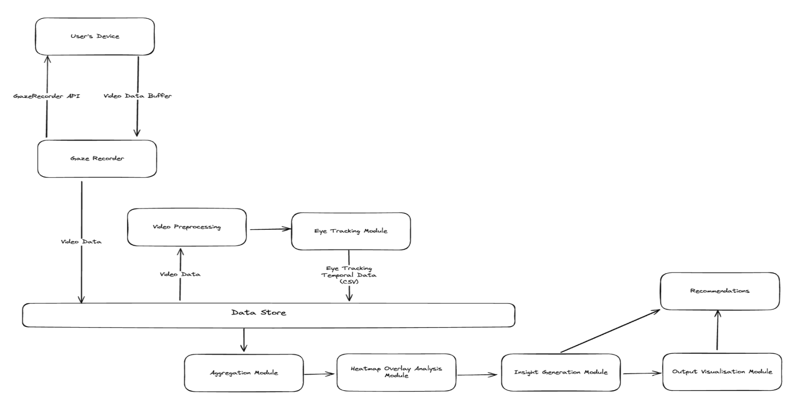

# Free-Viewing-Based-Visual-Attention-Model
This proposed project aims to enhance the User Experience Design (UXD) of user dashboards through the use of a Free Viewing-Based Visual Attention Model (FVB-VAM).
By understanding how users perceive visual information and what areas they focus on, designers can improve the layout and effectiveness of the dashboards.

# Objective
The objective of this project is to develop a Free Viewing-Based Visual Attention Model (FVB-VAM) that can predict the visual attention of users when viewing a dashboard. The model will be trained on eye-tracking data collected from users viewing a set of dashboards. The model will then be used to generate heatmaps that show the areas of the dashboard that are most likely to attract the user's attention.

# Architecture
A high level visual representation of the overall architecture of the project is shown below.
